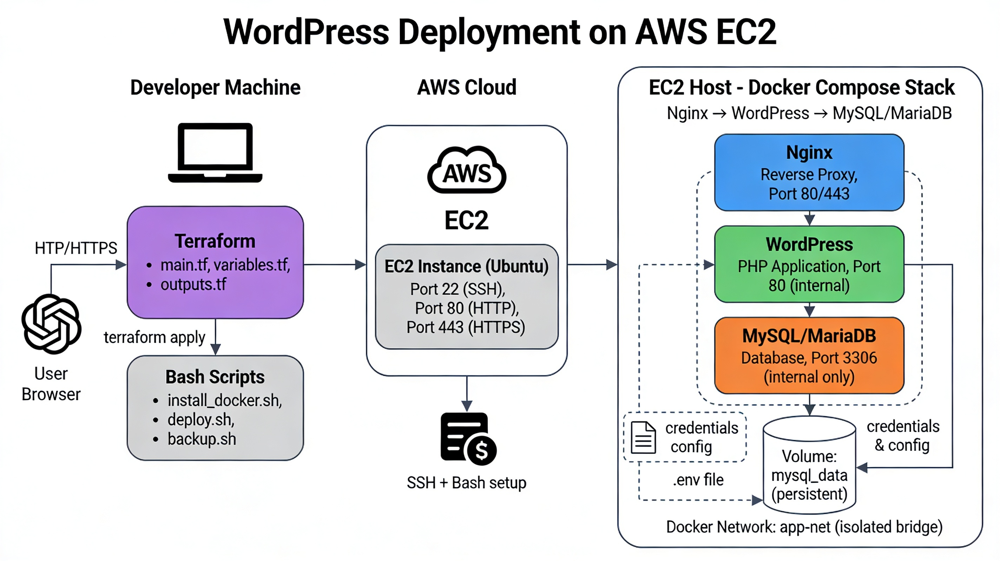

# WordPress Deployment on AWS EC2

## Project Overview

This is a hands-on DevOps assignment. Your goal is to provision a cloud server on AWS, configure it using Linux scripting, and deploy a fully working WordPress application using Docker Compose — all automated, repeatable, and production-minded.




---

## Technologies Used

| Technology | Purpose |
|---|---|
| **Terraform** | Provision AWS infrastructure as code |
| **AWS EC2** | Cloud virtual machine to host the application |
| **Bash Scripting** | Automate server setup and deployment |
| **Docker** | Container runtime on the EC2 instance |
| **Docker Compose** | Define and run the multi-container application stack |
| **Nginx** | Reverse proxy handling all incoming HTTP traffic |
| **WordPress** | PHP application serving the website |
| **MySQL / MariaDB** | Relational database storing WordPress data |

---

## Architecture

The project is built across three layers:

1. **Your Machine** — You write and run Terraform to provision AWS resources, and Bash scripts to configure and deploy everything remotely.
2. **AWS Cloud** — An EC2 instance (Ubuntu) is provisioned with the right security group rules and SSH key access.
3. **EC2 Host** — Docker Compose runs three containers on the server inside an isolated Docker network. Nginx is the only container exposed to the internet. WordPress communicates internally with MySQL. The database is never accessible from outside the host.

---

## Project Structure

Organise your repository like this:

```
wordpress-ec2-project/
├── README.md
├── docker-compose.yml
├── .env.example
├── .gitignore
├── terraform/
│   ├── main.tf
│   ├── variables.tf
│   └── outputs.tf
├── nginx/
│   └── nginx.conf
└── scripts/
    ├── install_docker.sh
    ├── deploy.sh
    └── validate.sh
```

---

## Tasks

### Task 1 — Terraform: Provision AWS Infrastructure

Use Terraform to create all required AWS resources. You should **not** create anything manually through the AWS console.

**What you need to provision:**
- An EC2 instance running Ubuntu 22.04 LTS (`t2.micro` is free tier eligible)
- A Security Group that allows inbound SSH (port 22) and HTTP (port 80)
- A Key Pair so you can SSH into the instance

**What to output:**
- The public IP address of the instance, so you can use it in later steps

**Hints:**
- Start with `terraform init` to initialise the working directory
- Use `terraform plan` before applying — read the output carefully before you confirm anything
- Store your region, AMI ID, and instance type as variables, not hardcoded values
- The `outputs.tf` file is where you expose values like the public IP after provisioning
- After running `terraform apply`, you should be able to SSH into the instance with your key

---

### Task 2 — Bash Scripting: Prepare the Server

Write a Bash script that installs Docker and Docker Compose on the EC2 instance. You must be able to run this script remotely over SSH.

**What the script must do:**
- Update system packages
- Install Docker CE and the Docker Compose plugin
- Add the current user to the `docker` group so you can run Docker without `sudo`
- Print the installed versions to confirm success


---

### Task 3 — Docker Compose: Understand the Application Stack

The reference `docker-compose.yml` is provided to you. Before deploying, you must understand what it does and why it is structured the way it is.

**Questions you should be able to answer:**
- Why does the `db` service use `expose` instead of `ports`?
- Why does `wordpress` use `depends_on` with `condition: service_healthy`?
- Why is `nginx` the only service with a `ports` mapping to the host?
- What does the `app-net` network achieve?
- Why does WordPress use `db` as the database hostname instead of `localhost`?

**Configuration you must handle:**
- Copy `.env.example` to `.env` and fill in real values for all database credentials
- Make sure `.env` is listed in your `.gitignore` — it must never be committed to your repository


---

### Task 4 — Deploy the Application

Write a Bash script that copies the project files to your EC2 instance and starts the Docker Compose stack.

**What the script must do:**
- Accept the EC2 public IP and SSH key path as arguments
- Copy `docker-compose.yml`, `.env`, and the `nginx/` directory to the server
- SSH into the server and run `docker compose up -d`
- Print the URL where the site will be accessible


---

### Task 5 — Validate the Deployment

Write a validation script that confirms everything is working correctly.

**What the script must check:**
- All three containers are running (not just started — actually running and healthy)
- The WordPress site responds with a valid HTTP status code at the public IP
- The database service is healthy and accepting connections


---

## Deployment Workflow

Follow these steps in order:

```
1. terraform init → terraform plan → terraform apply
         ↓  note the public IP from the output
2. scp install_docker.sh to EC2 → run it via SSH
         ↓
3. cp .env.example .env → fill in your credentials
         ↓
4. bash scripts/deploy.sh <PUBLIC_IP> <KEY_PATH>
         ↓
5. Open http://<PUBLIC_IP> in your browser → complete the WordPress setup wizard
         ↓
6. bash scripts/validate.sh <PUBLIC_IP> <KEY_PATH>
         ↓
7. terraform destroy  ←  run this when done to avoid AWS charges
```

---

## Useful Commands Reference

```bash
# SSH into the instance
ssh -i ~/.ssh/id_rsa ubuntu@<PUBLIC_IP>

# Check container status
docker compose ps

# Follow logs in real time
docker compose logs -f

# Follow logs for a single service
docker compose logs -f nginx

# Restart a specific service
docker compose restart wordpress

# Open a shell inside a container
docker compose exec wordpress bash
docker compose exec db bash

# Stop the stack without removing volumes
docker compose down

# Destroy all AWS infrastructure when done
cd terraform/ && terraform destroy
```

---